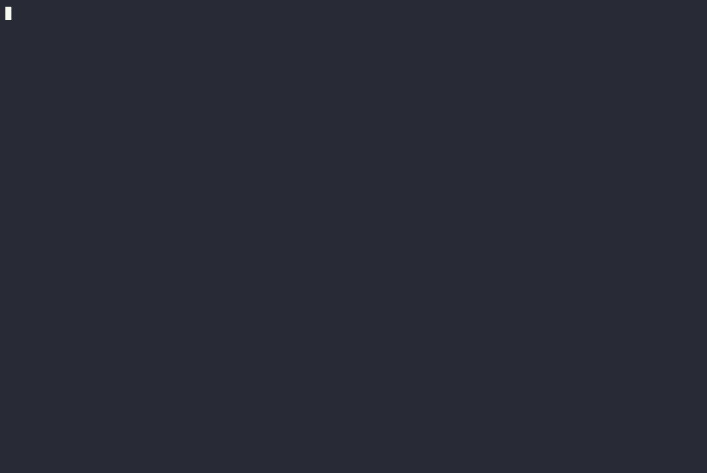

# wegglist



## Introduction

wegglist is a Go wrapper around [weggli](https://github.com/weggli-rs/weggli) that centralizes and organizes semantic search patterns into themes, so a full set of patterns can be run against a codebase in a single command instead of one `weggli` invocation per pattern.

Most patterns are sourced from [0xdea/weggli-patterns](https://github.com/0xdea/weggli-patterns). The project was also inspired by [this article](https://dustri.org/b/playing-with-weggli.html).

## Requirements

- Go 1.21 or later
- [weggli](https://github.com/weggli-rs/weggli) installed and available on `PATH`

## Installation

```bash
go build .
```

## Usage

```bash
Usage of ./wegglist:
  -json string
        Path to json rules file (default "cmd.json")
  -list
        List available themes and exit
  -list-detailed
        List available themes with detailed information
  -output string
        Path to a file to also write results to, in addition to stdout
  -path string
        Path to source code (default ".")
  -theme string
        Comma-separated list of themes to analyze. Use 'all' to analyze all themes. (default "all")
```

Exit code is non-zero if at least one pattern failed to run (for example, due to invalid syntax), which makes it suitable for use in scripts or CI.

## Rule file format

```json
[
  {
    "name": "Theme Name",
    "short": "themeShortName",
    "commands": [
      {
        "code": "pattern",
        "regex": "optional regex filter, adds the weggli -R option",
        "unique": false,
        "comment": "pattern description"
      }
    ]
  }
]
```

See [cmd.json](cmd.json) for a complete example.

## Contributing

Contributions are welcome. Fork the repository, add themes and patterns to `cmd.json`, and open a pull request. See [LICENSE](LICENSE.md) for license terms.

## Roadmap

- Add more patterns
- Add C++ support
- Add a `--extensions` option
- Add more test coverage
